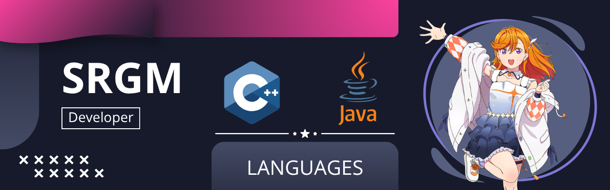

  <h3>Hi! 👋 I'm Santiago Gómez</h3>
  
<em>Computer Science Student | Exploring the world of code one line at a time | (English/Spanish)</em>

---

### 👨‍💻 About Me

* 🎓 **Background:** I am a Computer Science student at **ESPOL**, specializing in game logic and Object-Oriented Programming.
* ⚙️ **Current Focus:** Mastering core software fundamentals, from building robust terminal applications to developing custom 2D game engines.
* 🌱 **Motivation:** I'm highly driven to learn, grow as a developer, and turn complex logic into interactive experiences.
* 🤝 **Let's Connect:** Always open to feedback, collaboration, and learning from the global developer community!
